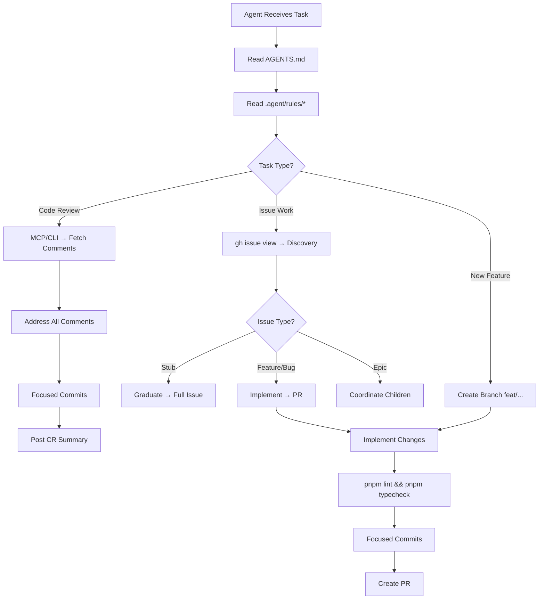

# 🐾 PSL Repository Boilerplate

> **Purrfect Software Limited — Universal Agent & Workflow Boilerplate**
>
> Distilled from cross-analysis of 6 PSL repositories. Copy the sections you need, fill in the `{{PLACEHOLDERS}}`, and delete what doesn't apply.

---

## 📊 Cross-Repo Analysis Summary

The following table shows which conventions are shared across the audited repos:

| Convention | mm-website | purrfectcore-client | Jasper | purrmission (both) | garage-band |
|:---|:---:|:---:|:---:|:---:|:---:|
| **Turborepo Monorepo** | ✅ | ✅ | ✅ | ✅ | ❌ (single plugin) |
| **pnpm** | ✅ | ✅ | ✅ | ✅ | ✅ |
| **TypeScript Strict** | ✅ | ✅ | ✅ | ✅ | ✅ |
| **AGENTS.md Entrypoint** | ✅ | ✅ (CLAUDE.md) | ✅ (overview.md) | ✅ | ❌ |
| **`.agent/rules/` Directory** | ✅ (9 files) | ✅ (9 files) | ✅ (16 files) | ✅ (11 files) | ❌ |
| **Husky + commitlint** | ✅ | ✅ | ✅ | ✅ | ❌ |
| **Conventional Commits** | ✅ | ✅ | ✅ | ✅ | ❌ |
| **`.editorconfig`** | ✅ | ✅ | ❌ | ✅ | ❌ |
| **`.nvmrc`** | ✅ (22) | ✅ (22) | ✅ (24.9) | ✅ (24.12) | ❌ |
| **`.pawthyrc` (Pawthy)** | ✅ | ✅ | ❌ | ✅ | ❌ |
| **`mcp.json`** | ✅ (7 servers) | ✅ (6 servers) | ✅ (6 servers) | ✅ (4 servers) | ❌ |
| **`project-config.json`** | ✅ | ✅ | ❌ | ❌ | ❌ |
| **GitHub Issue Templates** | ✅ (7 types) | ✅ (2 types) | ✅ (7 types) | ✅ (2 types) | ❌ |
| **`.github/copilot-instructions.md`** | ✅ | ❌ | ✅ | ❌ | ❌ |
| **`scripts/sync-mcp.js`** | ✅ | ❌ | ✅ | ✅ (.cjs) | ❌ |
| **`scripts/gh-pr-review-comments.*`** | ✅ (.js) | ✅ (.cjs) | ✅ (.js) | ✅ (.cjs) | ❌ |
| **Prisma ORM** | ✅ | ✅ | ✅ | ✅ | ❌ |
| **lint-staged** | ✅ | ✅ | ✅ | ✅ | ❌ |

### Common Agent Rules (Present in ≥4 repos)

| Rule File | Purpose |
|:---|:---|
| `guardrails.md` | Branch protection, zero-tolerance error handling, output safety |
| `coding-standards.md` | Code style, safety-first principles, documentation discipline |
| `issue-creation-standards.md` | Issue template schema, labeling, tooling |
| `issue-execution.md` | Discovery → Type-specific analysis → Engagement |
| `pr-code-review-address-guidelines.md` | Fetch, address, and report on PR review cycles |
| `project-structure.md` | Monorepo map of `apps/` vs `packages/` |
| `tech-stack.md` | Framework, language, styling, API, DB, Auth patterns |
| `onboarding.md` / `overview.md` | Quick-start guide for agents entering the repo |
| `security-standards.md` | Dependency audit, CVE response |

### Common Scripts (Present in ≥3 repos)

| Script | Purpose |
|:---|:---|
| `sync-mcp.js` / `sync-mcp.cjs` | Sync `mcp.json` → Claude Desktop / VS Code / Codex / Antigravity configs |
| `gh-pr-review-comments.js` / `.cjs` | Fetch PR review comments for agent-driven CR workflows |
| `test-mcp.js` | Verify MCP server startup and connectivity |
| `antigravity.js` / `antigravity.cjs` | Antigravity IDE integration helper |
| `quick-start.sh` | One-command environment bootstrap |

---

## 🗂️ Boilerplate File Tree

```
{{PROJECT_ROOT}}/
├── .agent/
│   └── rules/
│       ├── guardrails.md
│       ├── coding-standards.md
│       ├── issue-creation-standards.md
│       ├── issue-execution.md
│       ├── pr-code-review-address-guidelines.md
│       ├── project-structure.md
│       ├── tech-stack.md
│       ├── onboarding.md
│       └── security-standards.md
├── .editorconfig
├── .github/
│   ├── copilot-instructions.md
│   ├── ISSUE_TEMPLATE/
│   │   ├── 01_feature.yml
│   │   ├── 02_enhancement.yml
│   │   ├── 03_bug.yml
│   │   ├── 04_infrastructure.yml
│   │   ├── 05_documentation.yml
│   │   ├── 06_epic.yml
│   │   └── 07_stub.yml
│   └── workflows/
│       └── {{ci-workflow}}.yml
├── .gitignore
├── .husky/
│   ├── pre-commit
│   └── commit-msg
├── .lintstagedrc.json
├── .nvmrc
├── .pawthyrc
├── AGENTS.md
├── apps/
│   └── {{app-name}}/
├── commitlint.config.js
├── mcp.json
├── package.json
├── packages/
│   └── {{package-name}}/
├── pnpm-workspace.yaml
├── scripts/
│   ├── sync-mcp.js
│   ├── test-mcp.js
│   └── gh-pr-review-comments.js
├── tsconfig.json
└── turbo.json
```

---

## 📝 AGENTS.md

> The canonical entrypoint every agent reads first. Adapt based on repo type.

```markdown
# {{PROJECT_NAME}} Agent Guide

This file defines baseline behavior for coding agents working in this repository.

## First Read

Start with these rule files before making changes:

- `.agent/rules/guardrails.md`
- `.agent/rules/coding-standards.md`
- `.agent/rules/project-structure.md`
- `.agent/rules/tech-stack.md`
- `.agent/rules/issue-execution.md`

If the task is issue-creation related, also read:

- `.agent/rules/issue-creation-standards.md`

If the task is code-review-feedback related, also read:

- `.agent/rules/pr-code-review-address-guidelines.md`

## Non-Negotiables

- Never commit directly to `{{DEFAULT_BRANCH}}`.
- Use focused, atomic commits.
- Do not suppress build, lint, or test failures silently.
- Do not edit lockfiles manually.
- Keep documentation and rules in sync with behavioral or workflow changes.

## Repo Shape

{{REPO_SHAPE_DESCRIPTION}}

<!-- Example for Monorepo: -->
<!-- This is a Turborepo monorepo. -->
<!-- - `apps/{{app}}`: {{description}}. -->
<!-- - `packages/*`: shared packages/config. -->
<!-- Respect app/package boundaries and prefer existing shared abstractions over duplication. -->

## MCP and Tooling

- MCP server source of truth is `mcp.json`.
- Use `pnpm mcp:sync` after MCP config changes.
- Use `pnpm mcp:inspect` to verify MCP server startup/connectivity.

## Working Style

- Prefer strict TypeScript-safe changes.
- Keep changes minimal and local to the task scope.
- Surface assumptions and risks clearly.
- When behavior changes, update docs in the same change.
```

---

## 🛡️ `.agent/rules/guardrails.md`

```markdown
# 🛡️ Guardrails & Footgun Prevention

**Warning**: Failure to follow these rules will result in rejected operations.

## 1. Branching Strategy (CRITICAL)

- **NEVER** commit directly to `{{DEFAULT_BRANCH}}`.
- **ALWAYS** create a new branch for every task:
  - `feat/...` for features.
  - `fix/...` for bugs.
  - `chore/...` for maintenance.
- If you find yourself on `{{DEFAULT_BRANCH}}`, STOP and `git checkout -b <new-branch>` immediately.

## 2. Environment Integrity

- **Clean Slate**: Before starting, ensure working tree is clean (`git status`).
- **Sync**: Ensure logic is based on latest `{{DEFAULT_BRANCH}}`.
- **Bail Early**: If the environment is dirty or out of sync, stop and notify the Operator.

## 3. Error Handling (ZERO TOLERANCE)

- **Fail Early**: If a command fails (exit code != 0), **STOP IMMEDIATELY**.
- **Report**: Notify the Operator or file a bug. Do not proceed with "happy path" assumptions.
- **No Sweeping Under the Rug**:
  - **NEVER** ignore lint, build, or test failures to "just get it done".
  - **NEVER** suppress errors without explicit instruction.
  - **NEVER** proceed without addressing the root cause or reporting the issue.

## 4. Commit Hygiene

- **Focused Commits**: Prefer small, atomic commits over massive dumps.
- **Traceability**: Link commits to issues where possible.
- **Message**: Use Conventional Commits (e.g., `feat: add login`).

## 5. Monorepo Safety

- **Boundaries**: Respect `apps/` vs `packages/` separation.
- **Deps**: Do not edit `pnpm-lock.yaml` manually.

## 6. Output Safety

- **Self-Correction**: Check `git status` before verifying. If you see `dist/`, `.next/`, or `tmp/` files, DO NOT add them.
- **Ignorance**: If temporary files appear, propose adding them to `.gitignore`.
```

---

## 📝 `.agent/rules/coding-standards.md`

```markdown
# 📝 Coding Standards & Agent Behavior

## 1. Safety First

- **Filesystem**: Verify file paths with `find_by_name` or `list_dir` before editing.
- **Testing**: Always implement 'QA Checklist' items manually if possible, or script them.
- **Dependencies**:
  - Do not add new npm packages without explicit user approval.
  - **MUST** run `pnpm audit` before adding/upgrading dependencies to check for CVEs.
- **Git Hygiene**:
  - **NEVER** commit directly to `{{DEFAULT_BRANCH}}`. Always use a feature branch.
  - **Check Branch**: Run `git status` before every `git add/commit` sequence.
  - **Granularity**: focused commits only. Separation of concerns (Deps vs Code vs Config). No "misc" or "wip".

## 2. Code Style

- **Components**: Functional Components, named exports.
- **Props**: Explicit Interfaces (no `any`).
- **State**: Use `useMemo`/`useCallback` for expensive computations.
- **Server Actions**: Use `server-only` package for data logic.

## 3. Communication

- **Updates**: Provide concise status updates (Task Boundary).
- **Errors**: Report errors clearly; do not hide them.
- **Decisions**: Reference `docs/specs/**/*.md` for architectural decisions.

## 4. Documentation Discipline

- **Freshness**: Always keep docs, agent rules, READMES, and comments up to date.
- **The 5-Minute Rule**: Before every PR, take 5 minutes to reflect on changes. Update any impacted documentation. Verify that all open threads/issues are addressed.
```

---

## 🔐 `.agent/rules/security-standards.md`

```markdown
# Security Standards & Dependency Management

## Dependency Upgrades

- **MUST** check for known vulnerabilities before adding or upgrading dependencies.
- **MUST** ensure vulnerability scans (e.g., `pnpm audit`) report no new vulnerabilities when modifying dependencies.
- **MUST NOT** introduce dependencies with critical or high severity vulnerabilities.
- **MUST** prioritize patching security vulnerabilities over feature work when alerted.

## CVE Response

- If a vulnerability is detected in a core framework (e.g., Next.js, React), upgrade immediately to the patched version.
```

---

## 📋 `.agent/rules/issue-creation-standards.md`

```markdown
# Issue Creation Standards

When creating or modifying GitHub Issues, you MUST adhere to the project's strict lifecycle standards.

## 1. Templates & Structure

Never create an unstructured issue. You must use the following schema for all "Work" issues (Features, Enhancements, Infra):

### Required Sections

1. **Objective / Preamble**: High-level goal.
2. **Acceptance Criteria**: Checkbox list of requirements.
3. **Implementation Brief**: Technical context or plan.
4. **QA Checklist**: Manual verification steps.

## 2. Title Format

- **Human Readable**: Titles must be concise, human-readable sentences or phrases.
- **No Prefixes**: Do NOT use conventional commit prefixes (e.g., `feat:`, `chore:`) in issue titles.
- **Exceptions**: Use square bracket labels only for high-level highlighting, e.g., `[Epic]`, `[Urgent]`.

## 3. Labeling

You must apply exactly one `type:*` label. Applying a `priority:*` label is recommended.

### Types (One Required)

- `type: feature` — New capabilities
- `type: enhancement` — Improvement to existing features
- `type: bug` — Fixes
- `type: infra` — DevOps/Config
- `type: docs` — Documentation
- `type: epic` — Tracking parents
- `type: stub` — Ideas, Incubation, Placeholders

### Priority (Optional but Recommended)

- `priority: P0` — Critical/Urgent
- `priority: P1` — High/Important
- `priority: P2` — Medium/Normal
- `priority: P3` — Low/Nice to have

## 4. Tooling

Use `gh issue create` with the `--label` and `--body` (or `--body-file`) flags to ensure compliance.
```

---

## 🎯 `.agent/rules/issue-execution.md`

```markdown
# 🎯 Issue Execution Protocol

When assigned to work on a GitHub Issue, you MUST follow this strict protocol.

## 1. Discovery Phase

**Immediately** fetch the full issue context and history:

```bash
gh issue view <ISSUE_ID> --comments
```

- If the issue cannot be found or accessed, STOP and report to the Operator.

## 2. Type-Specific Analysis

### 🌱 Stub (`type: stub`)

- **Goal**: Graduate to a full Issue (Feature/Epic).
- Verify if the "Context" is still current with the codebase.
- Draft a plan to fill the missing "Acceptance Criteria" and "Tech Brief".
- DO NOT implement code until the metadata is graduated.

### 🚀 Feature / Enhancement / Bug

- **Goal**: Implementation & PR.
- Verify all "Acceptance Criteria" are clear.
- Focus strictly on the defined scope.
- Create a focused PR with granular, traceable commits.

### 👑 Epic (`type: epic`)

- **Goal**: Management & Coordination.
- Check child issue status and ordering.
- Identify risks, blockers, or divergence from the plan.
- Update the "Execution Status" table.

## 3. Engagement Rules

- **Feedback Loops**: IF context is missing, ambiguous, or risky, initiate a feedback loop **IMMEDIATELY**. Do not make wild assumptions.
- **Blockers**: IF a dependency is missing or an architectural decision is needed, report it with clear **Next Steps**.
- **Output**: The ideal outcome is a **Pull Request** or a **Status Update**—never a silent failure.
```

---

## 📋 `.agent/rules/pr-code-review-address-guidelines.md`

```markdown
# Code Review Workflow

## Fetching PR Review Comments

First ensure you are on the correct branch and it is up to date.

### Primary Method: GitHub MCP Server (Recommended)

1. Use `mcp_github_get_pull_request` to fetch the PR context.
2. Use `mcp_github_get_pull_request_reviews` and `mcp_github_get_pull_request_comments` for inline comments.
3. Cross-reference comments to build an action plan.

### Fallback Method: CLI Scripts

```bash
# Discover available reviews
node scripts/gh-pr-review-comments.js <PR_NUMBER>

# Fetch specific review
node scripts/gh-pr-review-comments.js <PR_NUMBER> <REVIEW_ID>

# Delta mode (unaddressed feedback only)
node scripts/gh-pr-review-comments.js <PR_NUMBER> --delta
```

### Important Rules

- **Always use MCP tools first.** Only fallback to scripts if MCP fails.
- **NEVER** commit review comment files to git.
- **Auto-Proceed**: Continue fixing, committing, pushing, and replying unless clarification is needed.
- Once addressed, post a Top Level Reply to the PR addressing all feedback.

## Reporting Format

### Required Sections

1. **High-Level Brief**: Grouped summary of fixes.
2. **Detailed Stats Table**: Reviewer, Comments, Status, Latest Activity (UTC).
3. **Condensed Stats Panel**: `<details>` block with assessment summary.

> Wrap all GitHub handles in backticks (e.g., `@user`) to avoid notifications.
> Use absolute UTC timestamps, never relative times.
```

---

## 🗺️ `.agent/rules/project-structure.md`

```markdown
# 🗺️ Project Structure Map

This is a {{MONOREPO_TOOL}} monorepo.

## 📂 Apps

- **`apps/{{APP_NAME}}`**: {{APP_DESCRIPTION}}.
  - `app/` or `src/app/`: App Router / Entry point.
  - `components/`: UI Components.
  - `lib/`: Utilities.
  - `server/`: API Routers & Context (if applicable).

## 📦 Packages (Shared)

- **`packages/ui`**: Shared Design System.
- **`packages/config`**: Shared configurations (ESLint, TS, Tailwind).
- **`packages/validators`**: Shared Zod schemas.
- **`packages/database`**: Prisma Client singleton (if applicable).

## 🧭 Navigation Tips

- All new features belong in `apps/` unless explicitly shared.
- Use `@/` or `@workspace/` alias for root imports.
```

---

## 🛠️ `.agent/rules/tech-stack.md`

```markdown
# 🛠️ Tech Stack & Workflow

## Core Stack

- **Framework**: {{FRAMEWORK}} (e.g., Next.js 15 / Fastify / Discord.js)
- **Language**: TypeScript (Strict Mode)
- **Styling**: {{STYLING}} (e.g., Tailwind CSS + Shadcn/Radix)
- **API**: {{API_LAYER}} (e.g., tRPC v11 / REST / Discord Slash Commands)
- **Database**: {{DATABASE}} (e.g., PostgreSQL + Prisma ORM / SQLite)
- **Auth**: {{AUTH}} (e.g., NextAuth v5 / Discord OAuth)
- **AI Context**: Context7 MCP (Mandatory for documentation lookup)

## Key Workflows

- **Dev Server**: `pnpm dev`
- **Build**: `pnpm build`
- **Lint**: `pnpm lint`
- **Format**: `pnpm format`
- **Type Check**: `pnpm typecheck` or `pnpm type-check`
- **Database** (if applicable):
  - `pnpm db:push` / `pnpm prisma:generate`
  - `pnpm prisma:studio`

## Critical Patterns

> Document project-specific patterns here, e.g.:
> - **Images**: MUST use `ImageWithFallback`.
> - **Layout**: MUST use `Section`, `Container` components.
> - **Fetching**: Use tRPC hooks / `useFetchQuery` / `usePostData`.
```

---

## 🤖 `.agent/rules/onboarding.md`

```markdown
# 🤖 Agent Onboarding Protocol

Welcome, Agent. To become productive, digest the following:

## 1. Governance

- **Guardrails**: Read `.agent/rules/guardrails.md`.
- **Issue Standards**: Read `.agent/rules/issue-creation-standards.md`.
- **Execution Protocol**: Read `.agent/rules/issue-execution.md`.
- **Coding Standards**: Read `.agent/rules/coding-standards.md`.

## 2. Intelligence

- **Project Structure**: Read `.agent/rules/project-structure.md`.
- **Tech Stack**: Read `.agent/rules/tech-stack.md`.

## 3. Directives

- Always check `docs/specs/` for latest architectural decisions.
- Use file-search tools to locate files in the Monorepo (do not guess).
- Respect Strict Mode TypeScript.

Go forth and code.
```

---

## ⚙️ Config File Templates

### `.editorconfig`

```ini
root = true

[*]
charset = utf-8
indent_style = space
indent_size = 2
end_of_line = lf
trim_trailing_whitespace = true
insert_final_newline = true

[*.md]
trim_trailing_whitespace = false
```

### `.nvmrc`

```
22
```

> **Convention**: mm-website & purrfectcore use Node 22. Jasper uses 24.9, purrmission uses 24.12. Pick the version appropriate for your stack.

### `commitlint.config.js`

```javascript
module.exports = {
  extends: ["@commitlint/config-conventional"],
  rules: {
    "header-max-length": [2, "always", 200],
    "body-max-line-length": [0],
    "type-enum": [
      2,
      "always",
      [
        "build",
        "chore",
        "ci",
        "docs",
        "feat",
        "fix",
        "infra",
        "perf",
        "refactor",
        "revert",
        "style",
        "test",
      ],
    ],
  },
};
```

### `.husky/pre-commit`

```bash
bash scripts/git-hooks/verify-branch-name.sh && bash scripts/git-hooks/verify-artifacts.sh
```

> Adapt hooks to your repo. Simpler repos may use `npx lint-staged` directly.

### `.husky/commit-msg`

```bash
npx --no -- commitlint --edit ${1}
```

### `.lintstagedrc.json`

```json
{
  "*.{ts,tsx,js,jsx}": ["eslint --fix"],
  "*.{ts,tsx,js,jsx,json,md,yaml,yml}": ["prettier --write"]
}
```

### `.pawthyrc`

```json
{
  "projectId": "{{PAWTHY_PROJECT_ID}}",
  "envId": "{{PAWTHY_ENV_ID}}",
  "keys": [
    "{{SECRET_KEY_1}}",
    "{{SECRET_KEY_2}}"
  ]
}
```

> Pawthy is the PSL secret sync tool (`@kuasha420/pawthy`). `.pawthyrc` is committed; `.pawthy/` is `.gitignore`d.

### `pnpm-workspace.yaml`

```yaml
packages:
  - "apps/*"
  - "packages/*"
```

### `turbo.json`

```json
{
  "$schema": "https://turbo.build/schema.json",
  "globalEnv": [
    "NODE_ENV",
    "DATABASE_URL"
  ],
  "tasks": {
    "build": {
      "dependsOn": ["^build"],
      "outputs": [".next/**", "!.next/cache/**", "dist/**"]
    },
    "lint": {
      "dependsOn": ["^lint"]
    },
    "typecheck": {
      "dependsOn": ["^typecheck"]
    },
    "dev": {
      "cache": false,
      "persistent": true
    },
    "start": {
      "cache": false,
      "persistent": true
    }
  }
}
```

### `mcp.json`

```json
{
  "mcpServers": {
    "filesystem": {
      "command": "npx",
      "args": ["-y", "@modelcontextprotocol/server-filesystem", "."]
    },
    "context7": {
      "command": "npx",
      "args": ["-y", "@upstash/context7-mcp", "--api-key", "${CONTEXT7_API_KEY}"]
    },
    "prisma": {
      "command": "npx",
      "args": ["-y", "prisma", "mcp"],
      "env": { "DATABASE_URL": "${DATABASE_URL}" },
      "cwd": "{{PRISMA_CWD}}"
    },
    "github": {
      "command": "npx",
      "args": ["-y", "@modelcontextprotocol/server-github"],
      "env": { "GITHUB_PERSONAL_ACCESS_TOKEN": "${GITHUB_PERSONAL_ACCESS_TOKEN}" }
    }
  }
}
```

> **Optional servers** (add if relevant):
> - `postgres`: `modelcontextprotocol-server-postgres`
> - `gcloud`: `@google-cloud/gcloud-mcp`
> - `freepik`: `mcp-remote https://api.freepik.com/mcp`

### `package.json` (Root — Monorepo Scripts)

```json
{
  "name": "{{PROJECT_NAME}}",
  "private": true,
  "scripts": {
    "build": "turbo run build",
    "dev": "turbo run dev",
    "lint": "turbo run lint",
    "typecheck": "turbo run typecheck",
    "format": "prettier --write \"**/*.{ts,tsx,md}\"",
    "mcp:sync": "node scripts/sync-mcp.js",
    "mcp:inspect": "node scripts/test-mcp.js",
    "env:pull": "pawthy pull -f .env --merge",
    "env:push": "pawthy push -f .env",
    "prepare": "husky || true"
  },
  "devDependencies": {
    "@commitlint/cli": "^20.3.0",
    "@commitlint/config-conventional": "^20.3.0",
    "@kuasha420/pawthy": "^0.4.0",
    "husky": "^9.1.7",
    "lint-staged": "^16.0.0",
    "prettier": "^3.7.4",
    "turbo": "^2.7.0"
  },
  "packageManager": "pnpm@9.0.0",
  "engines": {
    "node": ">=22.0.0"
  }
}
```

---

## 🐙 GitHub Issue Templates

### `.github/ISSUE_TEMPLATE/01_feature.yml`

```yaml
name: "🚀 Feature Request"
description: Suggest a new feature or capability for the project
title: ""
labels: ["type: feature"]
body:
  - type: markdown
    attributes:
      value: |
        Thanks for proposing a new feature! Please provide as much detail as possible.

  - type: textarea
    id: objective
    attributes:
      label: Objective & Preamble
      description: What is the goal of this feature? What problem does it solve?
      placeholder: Provide a clear, high-level summary.
    validations:
      required: true

  - type: textarea
    id: acceptance-criteria
    attributes:
      label: Acceptance Criteria
      description: List the specific requirements that must be met.
      value: |
        - [ ] Criterion 1
        - [ ] Criterion 2
    validations:
      required: true

  - type: textarea
    id: implementation-brief
    attributes:
      label: Implementation Brief
      description: Technical details, architectural decisions, or proposed approach.
      placeholder: Outline the technical plan here.

  - type: textarea
    id: qa-checklist
    attributes:
      label: QA Checklist
      description: Steps to verify the feature works as expected.
      value: |
        - [ ] Manual test case 1
        - [ ] Manual test case 2
```

> **Additional templates to create**: `02_enhancement.yml`, `03_bug.yml`, `04_infrastructure.yml`, `05_documentation.yml`, `06_epic.yml`, `07_stub.yml`. Follow the same 4-section pattern (Objective, Acceptance Criteria, Implementation Brief, QA Checklist) with appropriate labels.

---

## 🤖 `.github/copilot-instructions.md`

```markdown
# GitHub Copilot Instructions

This repository uses Model Context Protocol (MCP) servers for local development.

## Available MCP Servers

### Filesystem MCP Server
- **Purpose**: Read project files and directory structure

### Context7 MCP Server
- **Purpose**: Retrieve up-to-date documentation for libraries and frameworks

### Prisma MCP Server
- **Purpose**: Introspect database schema

### GitHub MCP Server
- **Purpose**: Search and read repository content and issues

## Configuration

The MCP servers are configured in `mcp.json` at the repository root.
```

> Add Postgres, GCloud, or other servers as relevant to your project.

---

## 🔄 Agent Workflow Summary

The following workflows are common across PSL repos:



### Key Principles

1. **Never commit to the default branch** — always create `feat/`, `fix/`, or `chore/` branches.
2. **Fail early** — if any command fails, STOP and report.
3. **MCP-first** — use MCP tools before falling back to CLI scripts.
4. **Documentation freshness** — update docs in the same change as behavior changes.
5. **Pawthy for secrets** — use `pnpm env:pull` / `pnpm env:push` for environment sync.
6. **Conventional Commits** — `feat:`, `fix:`, `chore:`, `docs:`, `refactor:`, etc.
7. **Atomic commits** — separate deps vs code vs config changes.

---

## 🏁 Quick-Start for New Repos

```bash
# 1. Clone and enter
git clone {{REPO_URL}}
cd {{REPO_NAME}}

# 2. Node version
nvm use           # reads .nvmrc

# 3. Enable corepack (for pnpm)
corepack enable

# 4. Install dependencies
pnpm install

# 5. Environment setup
cp .env.example .env
pnpm env:pull     # if Pawthy is configured

# 6. Sync MCP (for agent tooling)
pnpm mcp:sync

# 7. Start development
pnpm dev
```

---

> [!TIP]
> **To use this boilerplate**: Copy the sections you need into your new repo, search-and-replace all `{{PLACEHOLDERS}}`, and delete any sections that don't apply to your project type (e.g., remove Prisma sections for a frontend-only repo).

> [!IMPORTANT]
> **`kuasha420/purrmission`** is the upstream of `purrfectsoft/purrmission` (private experimental soft-fork for passkey/WebAuthn research). They share identical structure and agent rules. The boilerplate reflects the unified pattern.
