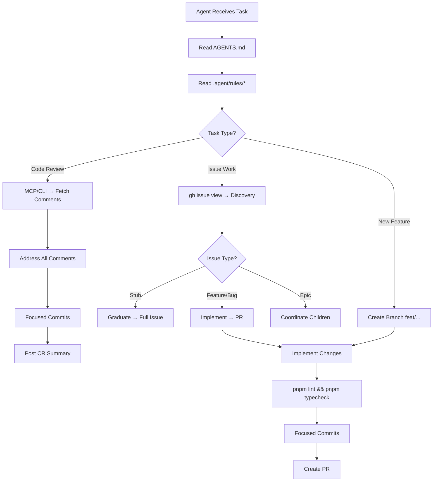

# 🐾 PSL Repository Boilerplate

> **Purrfect Software Limited — Universal Agent & Workflow Boilerplate**
>
> Distilled from cross-analysis of 6 PSL repositories. Copy the sections you need, fill in the `{{PLACEHOLDERS}}`, and delete what doesn't apply.

---

## 📊 Cross-Repo Analysis Summary

The following table shows which conventions are shared across the audited repos:

| Convention                            |   mm-website   | purrfectcore-client |      Jasper      | purrmission (both) |    garage-band     |
| :------------------------------------ | :------------: | :-----------------: | :--------------: | :----------------: | :----------------: |
| **Turborepo Monorepo**                |       ✅       |         ✅          |        ✅        |         ✅         | ❌ (single plugin) |
| **pnpm**                              |       ✅       |         ✅          |        ✅        |         ✅         |         ✅         |
| **TypeScript Strict**                 |       ✅       |         ✅          |        ✅        |         ✅         |         ✅         |
| **AGENTS.md Entrypoint**              |       ✅       |   ✅ (CLAUDE.md)    | ✅ (overview.md) |         ✅         |         ❌         |
| **`.agent/rules/` Directory**         |  ✅ (5 files)  |    ✅ (5 files)     |  ✅ (16 files)   |   ✅ (11 files)    |         ❌         |
| **Husky + commitlint**                |       ✅       |         ✅          |        ✅        |         ✅         |         ❌         |
| **Conventional Commits**              |       ✅       |         ✅          |        ✅        |         ✅         |         ❌         |
| **`.editorconfig`**                   |       ✅       |         ✅          |        ❌        |         ✅         |         ❌         |
| **`.nvmrc`**                          |    ✅ (22)     |       ✅ (22)       |    ✅ (24.9)     |     ✅ (24.12)     |         ❌         |
| **`.pawthyrc` (Pawthy)**              |       ✅       |         ✅          |        ❌        |         ✅         |         ❌         |
| **`mcp.json`**                        | ✅ (7 servers) |   ✅ (6 servers)    |  ✅ (6 servers)  |   ✅ (4 servers)   |         ❌         |
| **`project-config.json`**             |       ✅       |         ✅          |        ❌        |         ❌         |         ❌         |
| **GitHub Issue Templates**            |  ✅ (7 types)  |    ✅ (2 types)     |   ✅ (7 types)   |    ✅ (2 types)    |         ❌         |
| **`.github/copilot-instructions.md`** |       ✅       |         ❌          |        ✅        |         ❌         |         ❌         |
| **`scripts/sync-mcp.js`**             |       ✅       |         ❌          |        ✅        |     ✅ (.cjs)      |         ❌         |
| **`scripts/gh-pr-review-comments.*`** |    ✅ (.js)    |      ✅ (.cjs)      |     ✅ (.js)     |     ✅ (.cjs)      |         ❌         |
| **Prisma ORM**                        |       ✅       |         ✅          |        ✅        |         ✅         |         ❌         |
| **lint-staged**                       |       ✅       |         ✅          |        ✅        |         ✅         |         ❌         |

### Common Agent Rules (Present in ≥4 repos)

| Rule File        | Purpose                                                                |
| :--------------- | :--------------------------------------------------------------------- |
| `README.md`      | Main Entry & Navigation Index                                          |
| `overview.md`    | Tech stack, project structure, architecture details, and roadmap       |
| `development.md` | Safety guardrails, coding standards, TypeScript rules, and workflows   |
| `code-review.md` | PR delay rules, review comment fetching, and PR stats reporting        |
| `workflow.md`    | Onboarding guidelines, GitHub issue execution protocols, and templates |

### Common Scripts (Present in ≥3 repos)

| Script                               | Purpose                                                                  |
| :----------------------------------- | :----------------------------------------------------------------------- |
| `sync-mcp.js` / `sync-mcp.cjs`       | Sync `mcp.json` → Claude Desktop / VS Code / Codex / Antigravity configs |
| `gh-pr-review-comments.js` / `.cjs`  | Fetch PR review comments for agent-driven CR workflows                   |
| `test-mcp.js`                        | Verify MCP server startup and connectivity                               |
| `antigravity.js` / `antigravity.cjs` | Antigravity IDE integration helper                                       |
| `quick-start.sh`                     | One-command environment bootstrap                                        |

---

## 🗂️ Boilerplate File Tree

```
{{PROJECT_ROOT}}/
├── .agent/
│   └── rules/
│       ├── README.md
│       ├── overview.md
│       ├── development.md
│       ├── code-review.md
│       └── workflow.md
├── .editorconfig
├── .github/
│   ├── copilot-instructions.md
│   ├── ISSUE_TEMPLATE/
│   │   ├── 01_feature.yml
│   │   ├── 02_enhancement.yml
│   │   ├── 03_bug.yml
│   │   ├── 04_infrastructure.yml
│   │   ├── 05_documentation.yml
│   │   ├── 06_epic.yml
│   │   └── 07_stub.yml
│   └── workflows/
│       └── {{ci-workflow}}.yml
├── .gitignore
├── .husky/
│   ├── pre-commit
│   └── commit-msg
├── .lintstagedrc.json
├── .nvmrc
├── .pawthyrc
├── AGENTS.md
├── apps/
│   └── {{app-name}}/
├── commitlint.config.js
├── mcp.json
├── package.json
├── packages/
│   └── {{package-name}}/
├── pnpm-workspace.yaml
├── scripts/
│   ├── sync-mcp.js
│   ├── test-mcp.js
│   └── gh-pr-review-comments.js
├── tsconfig.json
└── turbo.json
```

---

## 📝 AGENTS.md

> The canonical entrypoint every agent reads first. Adapt based on repo type.

```markdown
# {{PROJECT_NAME}} Agent Guide

This file defines baseline behavior for coding agents working in this repository.

## First Read

Start with these rule files before making changes:

- `.agent/rules/README.md` (Main Entry & Navigation Index)
- `.agent/rules/overview.md` (Tech Stack & Architecture)
- `.agent/rules/development.md` (Coding Standards & Workflows)
- `.agent/rules/code-review.md` (PR Delay & Comment Fetching)
- `.agent/rules/workflow.md` (GitHub Issue Lifecycle & Onboarding)

## Non-Negotiables

- Never commit directly to `{{DEFAULT_BRANCH}}`.
- Use focused, atomic commits.
- Do not suppress build, lint, or test failures silently.
- Do not edit lockfiles manually.
- Keep documentation and rules in sync with behavioral or workflow changes.

## Repo Shape

{{REPO_SHAPE_DESCRIPTION}}

<!-- Example for Monorepo: -->
<!-- This is a Turborepo monorepo. -->
<!-- - `apps/{{app}}`: {{description}}. -->
<!-- - `packages/*`: shared packages/config. -->
<!-- Respect app/package boundaries and prefer existing shared abstractions over duplication. -->

## MCP and Tooling

- MCP server source of truth is `mcp.json`.
- Use `pnpm mcp:sync` after MCP config changes.
- Use `pnpm mcp:inspect` to verify MCP server startup/connectivity.

## Working Style

- Prefer strict TypeScript-safe changes.
- Keep changes minimal and local to the task scope.
- Surface assumptions and risks clearly.
- When behavior changes, update docs in the same change.
```

---

## 🤖 `.agent/rules/README.md`

```markdown
---
trigger: always_on
---

# 🤖 Agent Instructions & Workspace Entry

Welcome! This directory contains the consolidated workspace guidelines for the {{PROJECT_NAME}}. Review these instructions to align with project standards.

## 🧭 Navigation Index

- [Project Overview](overview.md) - Tech stack, codebase structure, architecture details, and project specs locator.
- [Development Standards](development.md) - Guardrails, TypeScript guidelines, code styles, and common workflows.
- [Code Review Guidelines](code-review.md) - PR delay rules, review fetching commands, and comment address guidelines.
- [Issue Workflow](workflow.md) - Onboarding rules, GitHub issue lifecycle, templates, and execution protocols.

## ⚡ Core Agent Directives

1. **Safety First**: Never commit directly to `{{DEFAULT_BRANCH}}`. Run `{{PACKAGE_MANAGER}} audit` before updates. Stop execution immediately on command errors.
2. **Context Integrity**: Keep all documentation, rules, and tests updated as code changes.
3. **No Placeholders**: Do not write stub/placeholder logic. Write complete, functional implementations.
```

---

## 📖 `.agent/rules/overview.md`

```markdown
---
trigger: model_decision
---

# 📖 Project Overview & Architecture

This document provides a cohesive reference for the {{PROJECT_NAME}}'s technologies, project directory structure, core architectures, and development roadmap.

## 🛠️ Technology Stack

- **Runtime**: Node.js v{{NODE_VERSION}}+ (ES Modules / TypeScript).
- **Package Manager**: {{PACKAGE_MANAGER}} (e.g., pnpm with Turborepo monorepo workspaces).
- **Framework**: {{FRAMEWORK}} (e.g., Next.js 15 App Router).
- **Styling**: {{STYLING}} (e.g., Tailwind CSS + packages/ui Shadcn/Radix).
- **API Layer**: {{API_LAYER}} (e.g., tRPC v11 + React Query).
- **Database**: {{DATABASE}} (e.g., PostgreSQL + Prisma ORM).
- **Authentication**: {{AUTH}} (e.g., NextAuth v5).
- **AI Context**: Context7 MCP (Mandatory for documentation lookup).

## 🗺️ Workspace Structure Map
```

{{WORKSPACE_MAP}}
<!-- Example for Monorepo:
{{PROJECT_ROOT}}/
├── apps/
│   └── {{APP_NAME}}/            # Main application
└── packages/                    # Shared Workspace Packages
    ├── config/                  # Shared configs
    └── ui/                      # Shared design system components
-->

```

## 🏗️ Architecture & Decision Documents

When designing or modifying components, refer to the spec files in `docs/`:

- **System Architecture**: [docs/system-architecture.md](file:///{{PROJECT_ROOT_URL}}/docs/system-architecture.md) - Details and specifications of the architecture.
<!-- Add relevant document links here -->

## 🗺️ Roadmap & Priorities

- [ ] **Test Coverage**: Implement testing harness and add coverage for shared helpers.
- [ ] **Security Audits**: Run standard security updates.
```

---

## 🛠️ `.agent/rules/development.md`

```markdown
---
trigger: always_on
---

# 🛠️ Development Standards & Workflows

## 🛡️ Guardrails & Safety First

1. **Branching Strategy**: **NEVER** commit directly to `{{DEFAULT_BRANCH}}`. Always create feature (`feat/`), bugfix (`fix/`), or chore (`chore/`) branches.
2. **Environment & Sync**: Run `git status` to ensure a clean slate before any commits. Propose gitignoring newly discovered temporary files instead of committing them.
3. **Dependencies & CVEs**: Do not install packages without approval. Run `{{PACKAGE_MANAGER}} audit` before upgrades/additions to check for vulnerability alerts.
4. **Shell Portability**: Prefer PATH-based discovery for `{{PACKAGE_MANAGER}}`. Verify active package manager and runtime versions on startup using `{{PACKAGE_MANAGER}} -v && node -v`.
5. **Fail Early**: Stop execution immediately on any non-zero exit code. Never ignore lint, test, or build errors.

## 📝 Code Standards & TypeScript Guidelines

- **Strict TypeScript**: Do not use `any`. Use `unknown` with type guards or explicit TypeScript types/interfaces for all variables and props.
- **React & Styling**: Use functional components with named exports. Utilize shared UI design primitive components from `{{UI_PACKAGE_ALIAS}}` (e.g., `@workspace/ui`).
- **State**: Optimize performance using `useMemo` and `useCallback` for complex structures or expensive computations.
- **Server Safety**: Use `server-only` declarations for pure data logic to prevent leaks.
- **Shared Schemas**: Define validation schemas under `{{VALIDATORS_PATH}}` (e.g., `packages/validators`) to ensure type consistency across client and server boundaries.

---

## 🚀 Key Workflows

Run the following scripts from the root directory:

### 1. Local Development & Verification

- **Dev Server**: `{{PACKAGE_MANAGER}} dev`
- **Build**: `{{PACKAGE_MANAGER}} build` (turbo-powered production compilation).
- **Linting**: `{{PACKAGE_MANAGER}} lint` (turbo-powered static analysis checks).
- **Format**: `{{PACKAGE_MANAGER}} format` (run Prettier format).
- **Typecheck**: `{{PACKAGE_MANAGER}} typecheck` (run TypeScript strict compiler checks).

### 2. Database Workflows (if applicable)

- **Db Schema Prototyping**: `{{PACKAGE_MANAGER}} db:push` (direct schema push).
- **Client Generation**: `{{PACKAGE_MANAGER}} db:generate` (generates db client).
```

---

## 🔍 `.agent/rules/code-review.md`

````markdown
---
trigger: always_on
---

# 🔍 Code Review & Pull Request Guardrails

## 🛡️ Pre-Merge Delay & Safety Checks

- **Mandatory PR Merge Delay**: Wait at least **10 minutes** before merging any pull request to allow reviewers and automated tools to post feedback.
- **Pre-Merge Review Check**: Immediately prior to merge, run the comment fetcher or check review comments using the GitHub MCP server to ensure all issues are resolved.
  `node scripts/gh-pr-review-comments.{{SCRIPT_EXTENSION}} <PR_NUMBER>` (e.g., `.js` or `.cjs`)
  Address, push, and reply to all feedback before merging.

---

## 📥 Fetching Review Comments

Always retrieve review comments using Git-ignored locations (e.g., `tmp/`) to save comment details. **NEVER** commit review comments files.

### Primary Method: GitHub MCP Server (Recommended)

1. Use `mcp_github_get_pull_request` to fetch the PR context.
2. Use `mcp_github_get_pull_request_reviews` and `mcp_github_get_pull_request_comments` for inline comments.
3. Cross-reference comments to build an action plan.

### Fallback Method: CLI Scripts

```bash
# 1. Discover active reviews
node scripts/gh-pr-review-comments.{{SCRIPT_EXTENSION}} <PR_NUMBER>

# 2. Fetch specific review comments
node scripts/gh-pr-review-comments.{{SCRIPT_EXTENSION}} <PR_NUMBER> <REVIEW_ID>

# 3. Delta Mode (Fetch only unaddressed comments)
node scripts/gh-pr-review-comments.{{SCRIPT_EXTENSION}} <PR_NUMBER> --delta --file ./tmp/new_feedback.md
```
````

- Parse priority levels from comments: `![critical]`, `![high]`, `![medium]`. Do not ignore feedback without explicit justification.
- **Auto-Proceed**: Execute fixes in focused, atomic commits, push changes, and reply to each thread.

---

## 📊 Review Statistics & Reporting

After addressing comments, post a top-level summary reply on the PR using this exact format:

### 1. High-Level Brief

- **Topic A**: Summary of fix.
- **Topic B**: Summary of fix.

### 2. Reviewer Stats Table

| Reviewer        | Comments | Status     | Latest  |
| :-------------- | :------- | :--------- | :------ |
| **`@username`** | 3        | ✅ 3 Fixed | 10m ago |

### 3. Condensed Stats Panel (Required Details Block)

Include a `<details>` block with this specific format:

```html
<details>
<summary>[Found and addressed a total of <Total> code review feedback from <Count> code reviews left by <ReviewerCount> reviewers between <StartTime> and <EndTime>. This Took ~<Duration> minutes for Antigravity Agent 47. Click to expand]</summary>

- **Reviewers**: <ReviewerCount> (`@reviewer`)
- **Coverage**: 100% Addressed
- **AI-Human Collaboration**: 🤖 Agent 47 x 👤 Reviewers
</details>
```

_Note: Wrap all GitHub usernames in backticks (e.g., `@user`) to prevent unwanted notifications._

````

---

## 🎯 `.agent/rules/workflow.md`

```markdown
---
trigger: always_on
---

# 🎯 GitHub Issues & Workspace Workflow

## 🤖 1. Onboarding Protocol

Welcome! To start work in this workspace:

- Familiarize yourself with the project structure and tech stack in `overview.md`.
- Read and follow the branching, coding, and safety guidelines in `development.md`.
- Explicitly locate target files using directory search tools before editing.

---

## 🚀 2. Issue Execution Protocol

### A. Discovery Phase

Immediately fetch the full context and conversation history of your assigned issue:

```bash
gh issue view <ISSUE_ID> --comments
````

_Note: If the issue cannot be found, stop and notify the Operator._

### B. Execution Strategy by Type

- 🌱 **Stub (`type: stub`)**: Draft a plan to fill in the missing "Acceptance Criteria" and "Tech Brief". **DO NOT** write code until the stub is graduated to a feature/bug.
- 🚀 **Feature / Enhancement / Bug**: Focus strictly on the defined scope. Create a branch and a focused PR with atomic commits.
- 👑 **Epic (`type: epic`)**: Coordinates child issues. Track ordering, identify blockers, and keep the execution status table updated.

### C. Engagement Rules

- **Feedback Loops**: If context is missing, ambiguous, or contains high risk, notify the Operator immediately.
- **Blockers**: Report missing dependencies or architectural questions with proposed next steps.

---

## 📋 3. Issue Creation Standards

When creating new issues, use the following standards:

### A. Structured Format

Every work issue (Feature, Enhancement, Infra) must contain:

1. **Objective / Preamble**: High-level goal.
2. **Acceptance Criteria**: Checkbox list of requirements.
3. **Implementation Brief**: Technical design or proposed steps.
4. **QA Checklist**: Manual verification steps.

### B. Title & Labels

- **Titles**: Use human-readable descriptions. **Do NOT use conventional commit prefixes** (e.g., `feat:`, `fix:`) in issue titles. (e.g., Use "Implement User Login" instead of "feat: add login").
- **Labels**: Apply exactly one `type:*` label (`feature`, `enhancement`, `bug`, `infra`, `docs`, `epic`, `stub`). Adding a `priority:*` label (`priority: P0` to `priority: P3`) is recommended.

Use the GitHub CLI (`gh issue create`) for compliant creation.

````

---

## ⚙️ Config File Templates

### `.editorconfig`

```ini
root = true

[*]
charset = utf-8
indent_style = space
indent_size = 2
end_of_line = lf
trim_trailing_whitespace = true
insert_final_newline = true

[*.md]
trim_trailing_whitespace = false
````

### `.nvmrc`

```
22
```

> **Convention**: mm-website & purrfectcore use Node 22. Jasper uses 24.9, purrmission uses 24.12. Pick the version appropriate for your stack.

### `commitlint.config.js`

```javascript
module.exports = {
  extends: ["@commitlint/config-conventional"],
  rules: {
    "header-max-length": [2, "always", 200],
    "body-max-line-length": [0],
    "type-enum": [
      2,
      "always",
      [
        "build",
        "chore",
        "ci",
        "docs",
        "feat",
        "fix",
        "infra",
        "perf",
        "refactor",
        "revert",
        "style",
        "test",
      ],
    ],
  },
};
```

### `.husky/pre-commit`

```bash
bash scripts/git-hooks/verify-branch-name.sh && bash scripts/git-hooks/verify-artifacts.sh
```

> Adapt hooks to your repo. Simpler repos may use `npx lint-staged` directly.

### `.husky/commit-msg`

```bash
npx --no -- commitlint --edit ${1}
```

### `.lintstagedrc.json`

```json
{
  "*.{ts,tsx,js,jsx}": ["eslint --fix"],
  "*.{ts,tsx,js,jsx,json,md,yaml,yml}": ["prettier --write"]
}
```

### `.pawthyrc`

```json
{
  "projectId": "{{PAWTHY_PROJECT_ID}}",
  "envId": "{{PAWTHY_ENV_ID}}",
  "keys": ["{{SECRET_KEY_1}}", "{{SECRET_KEY_2}}"]
}
```

> Pawthy is the PSL secret sync tool (`@kuasha420/pawthy`). `.pawthyrc` is committed; `.pawthy/` is `.gitignore`d.

### `pnpm-workspace.yaml`

```yaml
packages:
  - "apps/*"
  - "packages/*"
```

### `turbo.json`

```json
{
  "$schema": "https://turbo.build/schema.json",
  "globalEnv": ["NODE_ENV", "DATABASE_URL"],
  "tasks": {
    "build": {
      "dependsOn": ["^build"],
      "outputs": [".next/**", "!.next/cache/**", "dist/**"]
    },
    "lint": {
      "dependsOn": ["^lint"]
    },
    "typecheck": {
      "dependsOn": ["^typecheck"]
    },
    "dev": {
      "cache": false,
      "persistent": true
    },
    "start": {
      "cache": false,
      "persistent": true
    }
  }
}
```

### `mcp.json`

```json
{
  "mcpServers": {
    "filesystem": {
      "command": "npx",
      "args": ["-y", "@modelcontextprotocol/server-filesystem", "."]
    },
    "context7": {
      "command": "npx",
      "args": [
        "-y",
        "@upstash/context7-mcp",
        "--api-key",
        "${CONTEXT7_API_KEY}"
      ]
    },
    "prisma": {
      "command": "npx",
      "args": ["-y", "prisma", "mcp"],
      "env": { "DATABASE_URL": "${DATABASE_URL}" },
      "cwd": "{{PRISMA_CWD}}"
    },
    "github": {
      "command": "npx",
      "args": ["-y", "@modelcontextprotocol/server-github"],
      "env": {
        "GITHUB_PERSONAL_ACCESS_TOKEN": "${GITHUB_PERSONAL_ACCESS_TOKEN}"
      }
    }
  }
}
```

> **Optional servers** (add if relevant):
>
> - `postgres`: `modelcontextprotocol-server-postgres`
> - `gcloud`: `@google-cloud/gcloud-mcp`
> - `freepik`: `mcp-remote https://api.freepik.com/mcp`

### `package.json` (Root — Monorepo Scripts)

```json
{
  "name": "{{PROJECT_NAME}}",
  "private": true,
  "scripts": {
    "build": "turbo run build",
    "dev": "turbo run dev",
    "lint": "turbo run lint",
    "typecheck": "turbo run typecheck",
    "format": "prettier --write \"**/*.{ts,tsx,md}\"",
    "mcp:sync": "node scripts/sync-mcp.js",
    "mcp:inspect": "node scripts/test-mcp.js",
    "env:pull": "pawthy pull -f .env --merge",
    "env:push": "pawthy push -f .env",
    "prepare": "husky || true"
  },
  "devDependencies": {
    "@commitlint/cli": "^20.3.0",
    "@commitlint/config-conventional": "^20.3.0",
    "@kuasha420/pawthy": "^0.4.0",
    "husky": "^9.1.7",
    "lint-staged": "^16.0.0",
    "prettier": "^3.7.4",
    "turbo": "^2.7.0"
  },
  "packageManager": "pnpm@9.0.0",
  "engines": {
    "node": ">=22.0.0"
  }
}
```

---

## 🐙 GitHub Issue Templates

### `.github/ISSUE_TEMPLATE/01_feature.yml`

```yaml
name: "🚀 Feature Request"
description: Suggest a new feature or capability for the project
title: ""
labels: ["type: feature"]
body:
  - type: markdown
    attributes:
      value: |
        Thanks for proposing a new feature! Please provide as much detail as possible.

  - type: textarea
    id: objective
    attributes:
      label: Objective & Preamble
      description: What is the goal of this feature? What problem does it solve?
      placeholder: Provide a clear, high-level summary.
    validations:
      required: true

  - type: textarea
    id: acceptance-criteria
    attributes:
      label: Acceptance Criteria
      description: List the specific requirements that must be met.
      value: |
        - [ ] Criterion 1
        - [ ] Criterion 2
    validations:
      required: true

  - type: textarea
    id: implementation-brief
    attributes:
      label: Implementation Brief
      description: Technical details, architectural decisions, or proposed approach.
      placeholder: Outline the technical plan here.

  - type: textarea
    id: qa-checklist
    attributes:
      label: QA Checklist
      description: Steps to verify the feature works as expected.
      value: |
        - [ ] Manual test case 1
        - [ ] Manual test case 2
```

> **Additional templates to create**: `02_enhancement.yml`, `03_bug.yml`, `04_infrastructure.yml`, `05_documentation.yml`, `06_epic.yml`, `07_stub.yml`. Follow the same 4-section pattern (Objective, Acceptance Criteria, Implementation Brief, QA Checklist) with appropriate labels.

---

## 🤖 `.github/copilot-instructions.md`

```markdown
# GitHub Copilot Instructions

This repository uses Model Context Protocol (MCP) servers for local development.

## Available MCP Servers

### Filesystem MCP Server

- **Purpose**: Read project files and directory structure

### Context7 MCP Server

- **Purpose**: Retrieve up-to-date documentation for libraries and frameworks

### Prisma MCP Server

- **Purpose**: Introspect database schema

### GitHub MCP Server

- **Purpose**: Search and read repository content and issues

## Configuration

The MCP servers are configured in `mcp.json` at the repository root.
```

> Add Postgres, GCloud, or other servers as relevant to your project.

---

## 🔄 Agent Workflow Summary

The following workflows are common across PSL repos:



### Key Principles

1. **Never commit to the default branch** — always create `feat/`, `fix/`, or `chore/` branches.
2. **Fail early** — if any command fails, STOP and report.
3. **MCP-first** — use MCP tools before falling back to CLI scripts.
4. **Documentation freshness** — update docs in the same change as behavior changes.
5. **Pawthy for secrets** — use `pnpm env:pull` / `pnpm env:push` for environment sync.
6. **Conventional Commits** — `feat:`, `fix:`, `chore:`, `docs:`, `refactor:`, etc.
7. **Atomic commits** — separate deps vs code vs config changes.

---

## 🏁 Quick-Start for New Repos

```bash
# 1. Clone and enter
git clone {{REPO_URL}}
cd {{REPO_NAME}}

# 2. Node version
nvm use           # reads .nvmrc

# 3. Enable corepack (for pnpm)
corepack enable

# 4. Install dependencies
pnpm install

# 5. Environment setup
cp .env.example .env
pnpm env:pull     # if Pawthy is configured

# 6. Sync MCP (for agent tooling)
pnpm mcp:sync

# 7. Start development
pnpm dev
```

---

> [!TIP]
> **To use this boilerplate**: Copy the sections you need into your new repo, search-and-replace all `{{PLACEHOLDERS}}`, and delete any sections that don't apply to your project type (e.g., remove Prisma sections for a frontend-only repo).

> [!IMPORTANT]
> **`kuasha420/purrmission`** is the upstream of `purrfectsoft/purrmission` (private experimental soft-fork for passkey/WebAuthn research). They share identical structure and agent rules. The boilerplate reflects the unified pattern.
